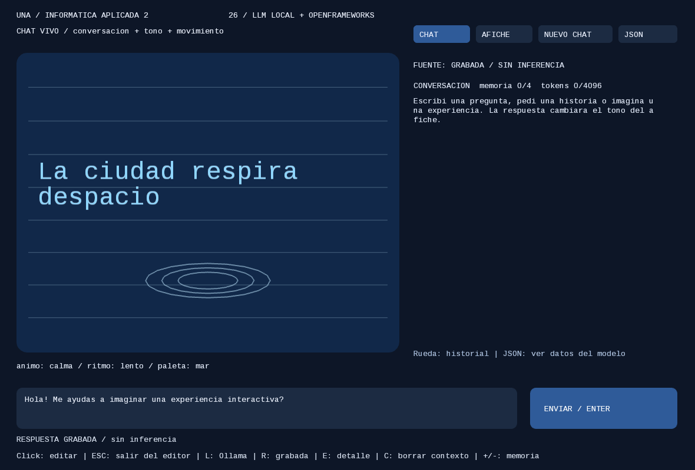
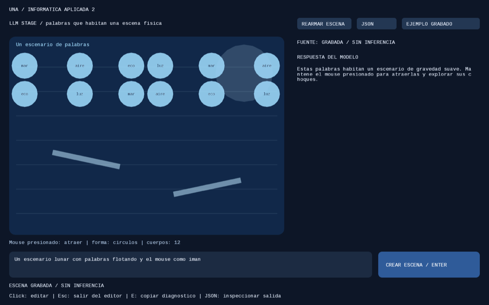
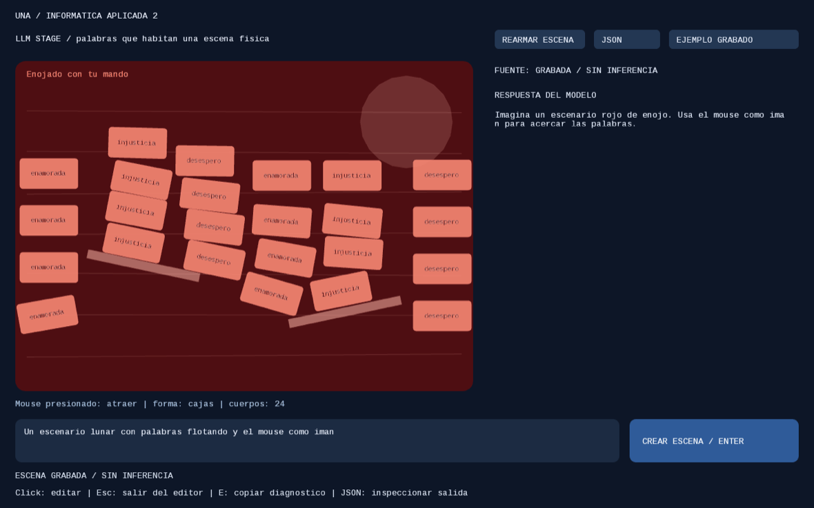
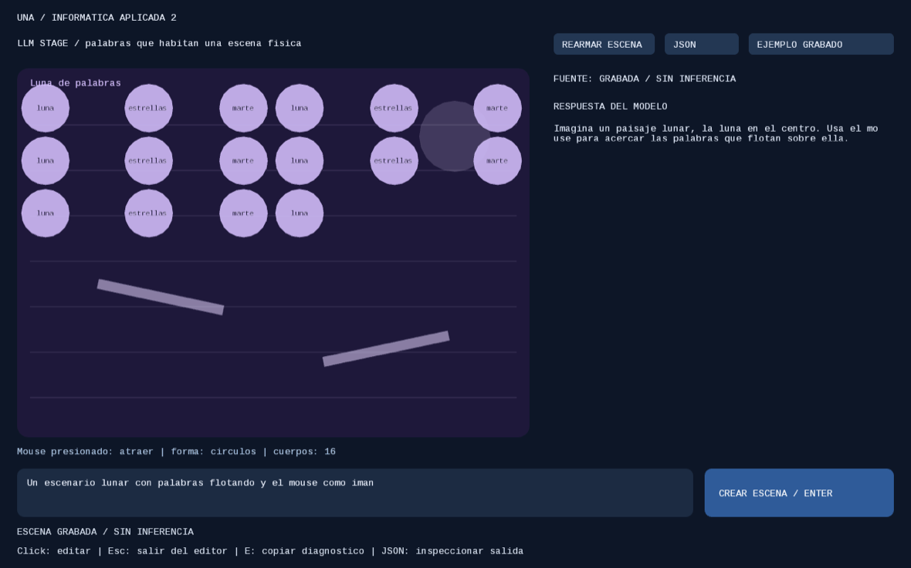

# LLM generativo local + openFrameworks

### LLM Stage - Example in OF
https://github.com/user-attachments/assets/52e9fc43-fe2a-4e8e-8aa3-cd1fcac6f82d

### LLM Poster - Example in OF
https://github.com/user-attachments/assets/e04236bc-dfb5-4709-9fa3-9c57587604e7

[Presentación de la clase (PDF)](LLMs_local_python_openFrameworks.pdf)

Escribimos un texto, **el modelo Qwen genera una respuesta** y OF la usa para crear una
experiencia interactiva. El afiche es un punto de partida: los alumnos pueden
cambiar la interfaz, el contrato y la representación.

```text
Ejemplo OF (llmPoster / llmStage) ── HTTP/JSON ──→ Ollama / Qwen
Práctica Python (opcional)        ── HTTP/JSON ──→ Ollama / Qwen
```

**Lo central de esta clase es openFrameworks.** OF conecta directamente con Ollama
mediante `ofxLocalLLM`. La práctica en Python (Gradio y consola) es **opcional**: sirve
para ver lo mismo con otra herramienta, pero no hace falta para usar OF. No se usa
Docker ni se necesita API key.

> **Cada ejemplo tiene su propio README** con la instalación, los controles y el
> recorrido del código. Este archivo es la guía general; para trabajar con un
> ejemplo, abrir el README de su carpeta:
>
> | README | Qué explica |
> | --- | --- |
> | [llmPoster/README.md](llmPoster/README.md) | Ejemplo OF de chat y afiche: controles, contexto (`chat-config.json`) y código |
> | [llmStage/README.md](llmStage/README.md) | Ejemplo OF con física Box2D: instalación de `ofxBox2d`, contrato de 9 campos y código |
> | [ofxLocalLLM/README.md](ofxLocalLLM/README.md) | Addon de conexión HTTP con Ollama, para reutilizar en otro sketch |
> | [practica/README.md](practica/README.md) | *Opcional:* práctica Python con Gradio (AFICHE, CHAT, ESCENARIO) y consola |
>
> Para agregar paletas, escenarios o cambiar el contexto: [docs/GUIA_ALUMNOS_ESCENARIOS.md](docs/GUIA_ALUMNOS_ESCENARIOS.md).

### Guía de pasos a seguir

1. **Instalar openFrameworks** 0.12.1 y su compilador.
2. **Instalar Ollama y Qwen** con el instalador de esta carpeta.
3. **Copiar las carpetas** `ofxLocalLLM/` y `llmPoster/` dentro de OF, importarlas
   con el Project Generator y compilar.
4. **Usar el ejemplo**: abrir `llmPoster` con Ollama activo.
5. Opcional: `llmStage` (Box2D) y la práctica en Python.

## 1. Instalar openFrameworks

Si ya lo tienen instalado, pasar al paso 2. Descargar **openFrameworks 0.12.1** desde
[openframeworks.cc/download](https://openframeworks.cc/download/) y descomprimirlo en
una carpeta fija (la llamamos **OF**). Adentro vienen `apps/`, `addons/` y el
**Project Generator** (`projectGenerator/`).

| Sistema | Compilador | Preparación |
| --- | --- | --- |
| macOS | **Xcode** (App Store) | Abrir Xcode una vez y aceptar la licencia |
| Windows | **Visual Studio 2022** (Community) | Instalar la carga de trabajo «Desarrollo para el escritorio con C++» |
| Linux | gcc / make | En `OF/scripts/linux/<distribución>/` ejecutar `sudo ./install_dependencies.sh`; después `OF/scripts/linux/compileOF.sh -j4` |

Para comprobar la instalación, abrir `OF/examples/templates/emptyExample` con el Project
Generator (o su IDE) y compilarlo una vez. Guía oficial por sistema:
[openframeworks.cc/download](https://openframeworks.cc/download/) → «setup guides».

## 2. Instalar Ollama y Qwen (con el script que ya se les da armado)

Guardar esta carpeta (el repo que clonaste) en su ubicación definitiva. Desde una terminal posicionada en esa carpeta:

```sh
# macOS
bash install_env_mac.command

# Linux
bash install_env_linux.sh
```

En Windows: doble clic en **install_env_windows.cmd**. Completar los permisos o
el asistente de Ollama si aparecen. El instalador deja listos **Ollama y
`qwen2.5:1.5b-instruct`**, que es lo que usa OF. De paso prepara Python 3.11 y `.venv`
(el instalador los usa internamente y la práctica opcional también). Precarga el modelo y muestra
su ubicación CPU/GPU. Esperar: **Preparado. Python, Ollama y Qwen disponibles.**

Se necesita internet para la preparación. openFrameworks, su compilador y
Project Generator se instalan por separado. Si macOS no permite abrir el
`.command`, usar el comando con `bash` de arriba.

**Al terminar, Ollama queda activo y Qwen precargado en memoria.** El instalador
reutiliza Ollama si ya estaba activo; de lo contrario inicia el servicio local
en `127.0.0.1:11434`. Ollama elige automaticamente GPU compatible, CPU/GPU o CPU
segun el equipo y la memoria disponible. No hace falta elegir CUDA o Metal en OF.
El instalador muestra la distribucion en la columna `PROCESSOR` de `ollama ps`.

La precarga se mantiene **5 minutos sin uso**; despues puede liberarse la memoria.
La siguiente consulta desde OF vuelve a cargar el modelo automaticamente, sin
descargarlo otra vez. Tras reiniciar la computadora, abrir Ollama o repetir el
instalador: este script no configura por si mismo el inicio automatico del sistema.

### El modelo que se instala: Qwen2.5 1.5B Instruct

Es el mismo modelo para todo: lo usan los ejemplos de **OF** (`llmPoster`, `llmStage`)
y, si se hace, la **práctica opcional** en Python. Corre en la propia computadora,
a través de Ollama; no necesita internet una vez descargado.

| | DistilBERT (clase de datos) | **Qwen2.5 1.5B Instruct** (esta clase) |
| --- | --- | --- |
| Tipo | Encoder: lee y clasifica | Decoder: genera texto palabra por palabra |
| Parámetros (pesos) | 66 millones | **1.543 millones** |
| Vocabulario (tokens posibles) | 30.522 | **151.936** |
| Contexto máximo | 512 tokens | **32.768 tokens** |
| Dimensiones por token | 768 | 1.536 |
| Capas | 6 | 28 |
| Tamaño en disco | 268 MB | ~990 MB (cuantizado Q4_K_M) |

Datos de `ollama show qwen2.5:1.5b-instruct`. Un **token** es un pedazo de palabra
(en español, en promedio, algo menos que una palabra). El contexto máximo es el techo:
el chat de `llmPoster` pide una ventana de 4.096 tokens (`num_ctx`), configurable en
`llmPoster/bin/data/chat-config.json` ([ver cómo](llmPoster/README.md#contexto-parametrizable)).
Solo las instrucciones del chat ya ocupan unos 450 tokens.

## 3. Copiar las carpetas a OF y compilar

Con OF instalado (paso 1) y Ollama con Qwen listos (paso 2), copiar los ejemplos
de esta clase **dentro de la carpeta de OF**. Copiar las carpetas **completas**
(`src/`, `bin/data/` y `addons.make`): `bin/data` tiene los prompts, la
configuración y la fuente con tildes.

1. Copiar **ofxLocalLLM/** a **OF/addons/ofxLocalLLM/** (el addon de conexión).
2. Copiar **llmPoster/** a **OF/apps/myApps/llmPoster/** (el ejemplo).
3. En Project Generator pulsar **import** y seleccionar `OF/apps/myApps/llmPoster`.
   Verificar **Project path = `OF/apps/myApps`** y **Project name = `llmPoster`**.
   El programa concatena ruta + nombre: poner `llmPoster` en la ruta y dejar
   `mySketch` como nombre crea otra carpeta con codigo vacio.
   Seleccionar **solo `ofxLocalLLM`**, dejar Additional source paths vacio y pulsar
   **Update**. El codigo a compilar es el de `llmPoster/src`.
4. Compilar: en Windows, abrir el proyecto generado con Visual Studio; en macOS con
   Xcode o con Make; en Linux con Make:

```sh
cd RUTA_A_OF/apps/myApps/llmPoster
make Release -j4
make RunRelease
```

No crear `llmPoster/mySketch`: sería una plantilla vacía. El ejemplo `llmPoster` no requiere
`ofxOsc` ni Box2D. La compilación se verificó con OF 0.12.1 en macOS; Windows/Linux
necesitan el SDK y compilador de su sistema y aún requieren validación nativa.

## 4. Usar el ejemplo

1. Mantener **Ollama abierto** y ejecutar `llmPoster`.
2. La app comprueba la conexión. El afiche inicial dice **SIN INFERENCIA** porque
   usa una respuesta grabada.
3. En **CHAT**, escribir una pregunta y pulsar **Enviar** o Enter. Aparecen la
   respuesta del modelo escrita progresivamente y una animacion segun su tono.
   **VER COMPLETA / Enter** adelanta la escritura. Conserva cuatro intercambios
   en memoria. **NUEVO CHAT** borra esa memoria; **JSON** permite ver los datos.
4. En **AFICHE**, escribir una idea y pulsar **Interpretar**: se mantiene el ejemplo
   original de texto a categorias visuales. Ver [controles y codigo](llmPoster/README.md).

La petición corre en un hilo de red, mientras OF continúa dibujando. No se abre
un selector de carpeta ni se inicia Python desde OF. El atajo **L comprueba
Ollama**; R recupera el afiche grabado y E copia el diagnóstico. Pulsar Esc para
salir del editor antes de usar los atajos. Cerrar OF deja Ollama disponible.

Después de reiniciar el equipo: abrir Ollama; en Linux iniciar su servicio o
usar `ollama serve` si no está activo. El instalador también puede repetirse.

## 5. Otra experiencia: texto + Box2D

[**llmStage: instalación y recorrido del código**](llmStage/README.md) convierte una
idea en un escenario físico de palabras. El LLM elige gravedad, rebote, forma y
colores; el alumno interactúa atrayendo o repeliendo los cuerpos con el mouse.
Usa `ofxLocalLLM` **y `ofxBox2d`**, con el mismo Ollama/modelo ya preparado.
Es un proyecto separado de `llmPoster`, con comentarios para reutilizar la conexión
y cambiar la representación. No se necesita descargar otro modelo.

Mismos pasos que el 3: copiar **llmStage/** a `OF/apps/myApps/`, instalar además
**ofxBox2d** en `OF/addons/` e importarlo con los dos addons. Detalle en su README.

## Cómo se ven los ejemplos en OF

**llmPoster** al abrir: chat a la derecha, afiche animado a la izquierda (respuesta grabada, sin inferencia).



**Cómo funciona el chat** (escribir → «Pensando…» → «Escribiendo…» → el afiche cambia):

<!-- GIF: guardar la grabación como docs/img/llmPoster_chat.gif y borrar estas dos líneas de comentario.
 -->

**Cómo se ve la respuesta** (Qwen real, pregunta: «¿Me ayudás a imaginar una instalación
sobre el mar de noche?»). A la izquierda, la conversación; con el botón **JSON**, los
datos crudos que devolvió el modelo:

| Conversación y afiche | Botón JSON: lo que devolvió Qwen |
| --- | --- |
|  |  |

El encabezado `memoria 1/4 tokens 462/4096` muestra el contexto usado. Para «el mar de
noche» Qwen eligió `tension` y `rapido` (zigzag rápido): el formato es válido, pero la
interpretación se puede discutir. **JSON válido no es lo mismo que interpretación correcta.**

**llmStage**, escena base (`bin/data/recorded.json`):



**Escenas generadas por Qwen** con el prompt de `llmStage`. Para la captura, la respuesta
de Qwen se cargó como ejemplo grabado; por eso la pantalla dice «GRABADA».

| «Un escenario rojo de enojo: cajas furiosas que caen fuerte y huyen del mouse» | «Un escenario lunar con palabras flotando y el mouse como imán» |
| --- | --- |
|  |  |
| Paleta `fuego`, 24 cajas, gravedad 15. Qwen eligió `atraer` aunque se pidió «huyen»: un ejemplo de respuesta para cuestionar. | Paleta `noche`, 16 círculos, gravedad −0.2 (flotan hacia arriba). |

## Opcional: la misma práctica en Python (Gradio y consola)

No es necesario para la clase de OF. Es el mismo recorrido (texto → Qwen → JSON →
representación) hecho con Python y la biblioteca Gradio, útil para ver la petición
y el contrato sin compilar nada.

Mantener Ollama abierto. **Para el ejemplo visual construido con Gradio, en la consola, pararse sobre la carpeta raiz de la clase y ejecutar:**

```sh
.venv/bin/python practica/interfaz.py
```

Se abre el navegador en **http://127.0.0.1:7860**. Escribir una idea y pulsar
**Generar con Qwen**: aparecen el JSON validado y un afiche animado. **Ver ejemplo
grabado** permite explorar la interfaz sin inferencia. La composición está
programada: el LLM genera el texto y las categorías.

Si ya habías instalado antes de agregar Gradio, actualizar una vez:

```sh
.venv/bin/python -m pip install -r requirements.txt
```

También se puede repetir el instalador. Mantener la terminal de la interfaz
abierta; Ctrl+C la detiene. Si 7860 está ocupado, usar `--port 7861`.
OF sigue conectando directamente con Ollama: no necesita esta interfaz abierta.

**Para estudiar primero la versión de consola**, desde esta raíz:

```sh
# Respuesta escrita a mano: no consulta el modelo
.venv/bin/python practica/clasificar_textos.py --recorded

# Inferencia real, directamente con Ollama
.venv/bin/python practica/clasificar_textos.py --text "El reloj acelera mis pasos"

# Consultar los seis textos del CSV
.venv/bin/python practica/clasificar_textos.py --dataset
```

En Windows sustituir `.venv/bin/python` por `.venv\Scripts\python.exe`.
Gradio inicia su interfaz local automáticamente. Para la consola y OF no hay
que iniciar otro servidor ni ejecutar un comando `serve` de Python.
Ver la [práctica y su código](practica/README.md).

## Archivos para trabajar

| Módulo | Qué contiene |
| --- | --- |
| [llmPoster/](llmPoster/README.md) | Interfaz y dibujo en OF; prompt y configuración |
| [llmStage/](llmStage/README.md) | Escenografía de palabras, física Box2D e interacción con mouse |
| [ofxLocalLLM/](ofxLocalLLM/README.md) | Conexión HTTP directa con Ollama, reutilizable desde otro sketch |
| [practica/](practica/README.md) | *Opcional:* interfaz Gradio, cliente de consola, contrato y representación |
| `setup_local.py`, `install_env_*`, `scripts/` | Preparación de herramientas, dependencias y modelo |
| `requirements.txt` | Pydantic y Gradio para la práctica Python (opcional) |
| `tests/`, `tools/` | Pruebas de transporte, instalación y ejemplo OF |
| `docs/` | Arquitectura, guía docente y validación |

`llmPoster/bin/data/connection.json` contiene una única configuración:

```json
{
  "ollama_url": "http://127.0.0.1:11434",
  "model": "qwen2.5:1.5b-instruct"
}
```

Python lee este archivo y OF usa la copia en sus datos. `model` es el nombre
real descargado en Ollama. Para usar otro, prepararlo en Ollama y actualizar
la configuración; no todos los modelos responden igual al prompt.

## Si algo falla

| Problema | Qué revisar |
| --- | --- |
| Ventana gris | Importar `llmPoster` existente; su `ofApp.cpp` contiene `drawPoster` |
| No conecta | Ollama abierto; URL `http://127.0.0.1:11434` |
| Modelo no encontrado | Repetir el instalador o ejecutar `ollama pull qwen2.5:1.5b-instruct` |
| JSON rechazado | E copia el detalle; el afiche anterior se conserva |
| SIN INFERENCIA | Es la respuesta de prueba; enviar un texto para generar otra |
| Al actualizar sigue pidiendo una carpeta Python | Se está ejecutando el ejemplo anterior; actualizar fuentes, `addons.make`, datos y regenerar con `ofxLocalLLM` |

Para repetir solo la comprobación de memoria CPU/GPU:

```sh
.venv/bin/python setup_local.py --check-model
```

Editar C++ requiere actualizar la copia en el SDK y recompilar. Cambiar prompt
o configuración requiere actualizar los datos de OF y reiniciar. Python usa
los archivos de esta carpeta. No copiar `.venv/` ni `.tools/` a otro equipo:
se crean con el instalador. Si se mueve la carpeta después de instalar,
renombrar esos directorios y repetir la preparación.

## Material de apoyo adicional

- [Arquitectura](docs/ARQUITECTURA.md): clientes, modelo y responsabilidades.
- [Validación](docs/VALIDACION.md): comprobaciones y límites.
- [Más info sobre el modelo Qwen](https://huggingface.co/Qwen/Qwen2.5-7B-Instruct)
  
Esta clase se centra en LLM generativo e interacción desde OF. Visión y
combinación multimodal tendrán sus propios ejemplos en las siguientes clases.
