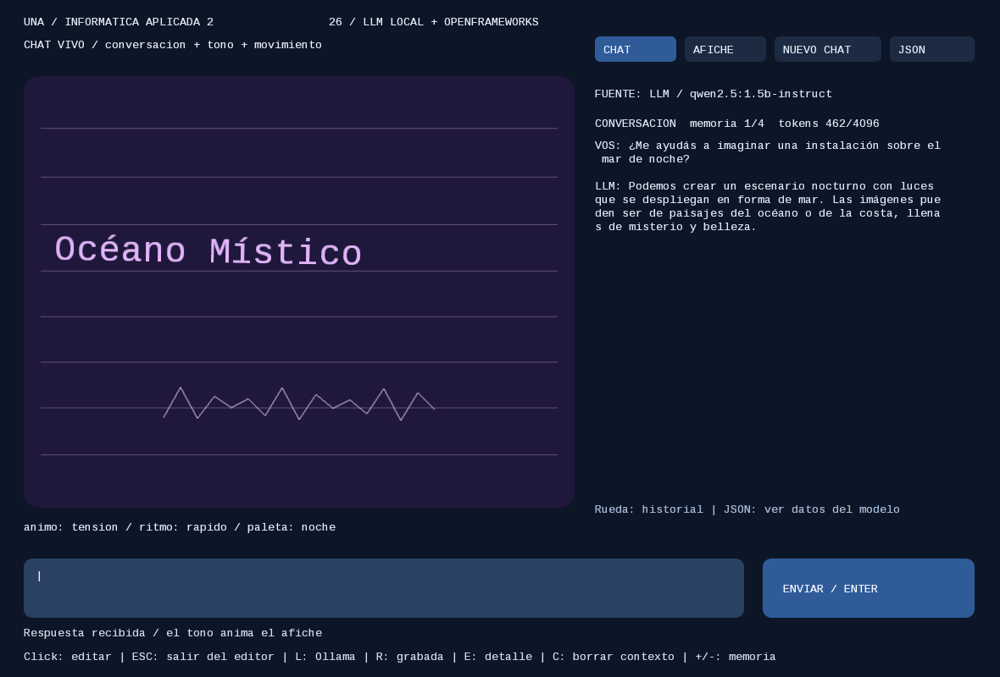
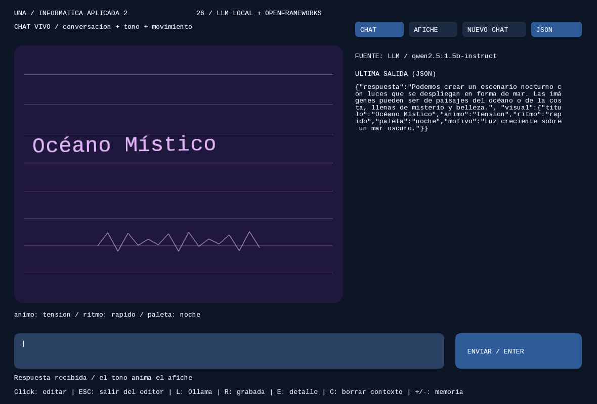

# llmPoster · LLM generativo + afiche interactivo

Seguir la [instalación de la raíz](../README.md). OF consulta a Ollama con
**ofxLocalLLM**, sin servidor Python intermedio.

| Respuesta del chat | Botón JSON |
| --- | --- |
|  |  |

## Chat y afiche

Al abrir, el modo **CHAT** permite hacer preguntas y conversar. El modelo devuelve
una respuesta breve y un objeto `visual`; OF valida los datos y anima el afiche.
**AFICHE** conserva la practica original: interpretar un texto en cinco campos.

- **CHAT / AFICHE:** cambiar de modo cuando no haya una solicitud pendiente.
- **ENVIAR / Enter:** enviar el texto. Durante la escritura, **VER COMPLETA / Enter** revela toda la respuesta.
- **NUEVO CHAT:** borrar la memoria local y volver al afiche grabado.
- **JSON:** alternar conversacion y datos de la ultima salida.
- **Rueda sobre la conversacion:** recorrer los mensajes.

Durante la consulta se muestra **Pensando...** con tres puntos animados y el
tiempo transcurrido, tanto en CHAT como en AFICHE. Al comprobar el servicio dice
**Conectando con Ollama...**. El indicador desaparece al recibir respuesta o error.
El tiempo no estima progreso. Después de recibir y validar la respuesta, aparece
**Escribiendo...** y el texto se revela a 40 caracteres por segundo, con cursor
intermitente. Es una animación local: HTTP entrega el JSON completo, sin streaming.
El historial conserva siempre la respuesta completa, aunque todavía se esté mostrando.
Cambiar el `40` de `typing.start(...)` en `response()` modifica la velocidad.

La memoria incluye los ultimos **cuatro intercambios completos** (por defecto), solo
durante esta ejecucion.

### Contexto parametrizable

`bin/data/chat-config.json` define el contexto sin recompilar:

| Clave | Qué controla | Rango |
| --- | --- | --- |
| `memoria` | Intercambios (pregunta + respuesta) que se reenvían en cada mensaje. `0` = sin memoria | 0 a 20 |
| `num_ctx` | Ventana de contexto de Ollama en tokens: instrucciones + historial + mensaje + respuesta | 512 a 32768 |

Con la app abierta (fuera del editor, después de Esc): **C** borra el contexto sin
cambiar el afiche, **+ / −** cambian la memoria. El encabezado de la conversación
muestra `memoria 2/4  tokens 539/4096`: cuántos intercambios se guardan y cuántos
tokens ocupó el último pedido (lo informa Ollama en `prompt_eval_count`). Solo las
instrucciones de `chat-prompt.txt` ocupan unos 450 tokens. Si el pedido supera
`num_ctx`, Ollama descarta lo más viejo sin avisar; la app avisa al pasar el 90%.
Más `num_ctx` usa más memoria RAM. Probar: memoria `0` → «Me llamo …» → «¿Cómo me
llamo?»: el modelo inventa un nombre.

Qwen2.5 1.5B admite hasta **32.768 tokens** de contexto, tiene un vocabulario de
**151.936 tokens** y 1.543 millones de parámetros (DistilBERT: 512, 30.522 y 66
millones). Ver la tabla completa en el [README de la clase](../README.md#el-modelo-qwen25-15b). Los errores no agregan turnos ni reemplazan el afiche valido.
Mientras llega una respuesta se puede escribir el siguiente mensaje.
El modelo puede conversar sobre temas variados, pero puede equivocarse y esta
configurado para responder brevemente. No consulta internet ni ejecuta herramientas.

El tono interpreta el texto de la respuesta; no mide emociones reales ni audio:
calma dibuja ondas que respiran, alegria circulos que rebotan y tension un zigzag.
`ritmo` controla velocidad y `paleta` los colores. Son animaciones programadas en
OF, elegidas por el LLM; no es generacion de imagen/video ni de codigo C++.

### Actualizar una copia existente

Actualizar también `OF/addons/ofxLocalLLM/`, incluido el nuevo `src/ofxTextReveal.h`.
Copiar **todos** los archivos de `src/` (incluido `ChatSession.h`) y de `bin/data/`
(incluido `chat-prompt.txt`) al proyecto que se compila. `src/TextStyle.h` y
`bin/data/LiberationMono-Regular.ttf` permiten dibujar ñ, tildes y ¿¡: la fuente
bitmap de OF solo tiene ASCII. Si falta el `.ttf`, vuelve a la fuente bitmap. Importar ese proyecto en
Project Generator, seleccionar `ofxLocalLLM`, pulsar Update y recompilar. No hace
falta reinstalar Python ni descargar otro modelo. La practica Python conserva su
contrato original de afiche y no usa el prompt de chat.

## Recorrido del código

1. `setup()` lee URL/modelo y prompt, conecta listeners y comprueba Ollama.
2. `send()` construye los mensajes `system/user` y llama a `llm.chat(request)`.
   En modo chat, `ChatSession::messages()` incorpora el historial.
3. `update()` llama a `llm.update()`, que entrega la respuesta del hilo de red.
4. `response()` recibe `body.message.content` de Ollama.
5. En chat, `ChatSession::accept()` valida respuesta/visual y guarda el turno.
   En modo afiche, `apply()` valida con `PosterSpec::parse()` antes de cambiar el afiche.
6. `ofxTextReveal` revela el último texto en `update()`; `drawPoster()` dibuja usando los datos validados.

La solicitud se envía al pulsar Enviar o Interpretar, no en cada frame. La app no ejecuta
Python ni descarga modelos. Ollama ejecuta Qwen; el addon solo comunica.

## Archivos para modificar

| Archivo | Responsabilidad |
| --- | --- |
| [src/ofApp.cpp](src/ofApp.cpp) | Interfaz, petición y uso de la respuesta |
| [src/ofApp.h](src/ofApp.h) | Estado de la aplicación |
| [src/ChatSession.h](src/ChatSession.h) | Contrato del chat e historial limitado |
| [bin/data/chat-prompt.txt](bin/data/chat-prompt.txt) | Instruccion conversacional y formato visual |
| [src/PosterSpec.h](src/PosterSpec.h) | Campos, categorías y límites del JSON |
| [src/PosterView.h](src/PosterView.h) | Composición, colores y movimiento |
| [bin/data/system-prompt.txt](bin/data/system-prompt.txt) | Instrucción al modelo |
| [bin/data/recorded.json](bin/data/recorded.json) | Respuesta manual, marcada SIN INFERENCIA |
| [bin/data/connection.json](bin/data/connection.json) | Dirección de Ollama y nombre del modelo |

## Controles

Click para editar; Enter/Interpretar para generar. Esc sale del editor.
L comprueba Ollama y que el modelo esté descargado; R carga la respuesta grabada;
E copia el diagnóstico. L ya no inicia ni detiene servidores. Cerrar OF
interrumpe la espera HTTP; Ollama puede terminar una generación que ya inició.

## Crear otra experiencia

Cambiar colores y movimiento en `PosterView.h`; luego cambiar el contrato y
el prompt para representar otras ideas. El LLM genera texto estructurado; las
imágenes del afiche se dibujan en C++, sin un modelo de difusión.

Para otro sketch, reutilizar [el addon](../ofxLocalLLM/README.md), registrar los
listeners y llamar `update()`. La interfaz y su comportamiento pertenecen al
sketch, no aparecen automáticamente por agregar el addon.

Actualizar las copias en el SDK al cambiar C++ o datos. Recompilar C++; reiniciar
para volver a leer prompt/configuración. Una respuesta inválida conserva el
último afiche válido.

## Siguiente ejemplo: escenografía física

[llmStage](../llmStage/README.md) reutiliza la misma conexión y la escritura progresiva,
pero convierte la respuesta en cuerpos Box2D que se atraen o repelen con el mouse.
Es independiente: `llmPoster` sigue necesitando solamente `ofxLocalLLM`.
